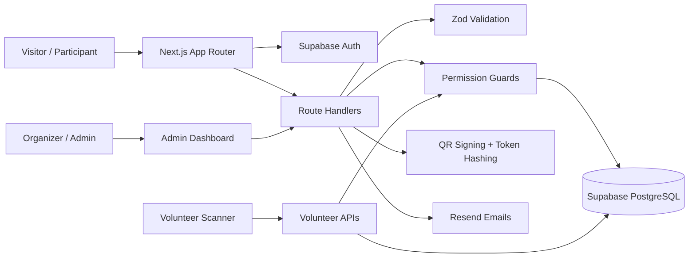

<div align="center">

# Dnyanothon 2026

### Premium hackathon operations platform for registrations, approvals, QR passes, service claims, and event control.

[](https://nextjs.org/)
[](https://react.dev/)
[](https://www.typescriptlang.org/)
[](https://supabase.com/)
[](https://tailwindcss.com/)
[](https://resend.com/)

**Dnyanothon 2026** is a full-stack event management system built with the Next.js App Router. It combines a high-impact public landing page with authenticated team registration, Supabase-backed approval workflows, signed QR passes, volunteer scanning, service redemption tracking, and transactional email automation.

[Live App](https://dnyanthon.vercel.app) · [Register](https://dnyanthon.vercel.app/register) · [Admin](https://dnyanthon.vercel.app/admin)

</div>

---

## Table of Contents

- [Overview](#overview)
- [Key Features](#key-features)
- [Tech Stack](#tech-stack)
- [Architecture](#architecture)
- [Project Structure](#project-structure)
- [Getting Started](#getting-started)
- [Environment Variables](#environment-variables)
- [Available Scripts](#available-scripts)
- [Core Workflows](#core-workflows)
- [API Reference](#api-reference)
- [Supabase Setup](#supabase-setup)
- [Security Model](#security-model)
- [Deployment Checklist](#deployment-checklist)
- [Key Files](#key-files)

---

## Overview

Dnyanothon 2026 is designed for real hackathon operations, not just a marketing page. The application supports the complete lifecycle of an event:

1. Participants discover the event and register teams.
2. Organizers review teams and approve or reject registrations.
3. Approved participants receive secure QR passes by email.
4. Volunteers scan QR passes to validate entry, meals, kits, certificates, and other services.
5. Admins monitor live statistics, scan activity, volunteer activity, and service consumption.

The default event slug used by the backend is `dnyanothon-2026`.

---

## Key Features

### Public experience

- Premium landing page with animated statistics, tracks, timeline, prizes, speakers, organizers, FAQ, and registration call-to-action.
- Responsive interface optimized for students, organizers, and event guests.
- Branded splash-screen experience for a polished first impression.

### Participant registration

- Supabase-authenticated registration flow.
- Team and participant submission support.
- Zod-powered server validation.
- Duplicate participant checks per event.
- Registration confirmation email flow.

### Admin operations

- Protected admin dashboard routes.
- Participant approval and rejection workflows.
- Team approval support.
- QR pass generation and resend capability.
- Dashboard statistics, participant exports, recent scans, meal/service status, and volunteer activity APIs.

### Volunteer operations

- QR verification endpoint with CORS support for scanning clients.
- Service claim recording for entry, breakfast, lunch, snacks, dinner, kits, and certificates.
- Offline scan synchronization endpoint.
- Volunteer duty and recent scan APIs.

### Security and reliability

- HMAC-signed QR payloads.
- Hashed QR token storage.
- Server-only Supabase service role usage.
- Database-backed role and permission checks.
- Rate-limit hooks for sensitive routes.
- Audit and email logging support.

---

## Tech Stack

| Layer | Technology |
| --- | --- |
| Framework | Next.js App Router |
| UI | React, Tailwind CSS, Framer Motion, Lucide React, React Icons, Recharts |
| Language | TypeScript |
| Auth | Supabase Auth with SSR helpers |
| Database | Supabase PostgreSQL with Row Level Security expectations |
| Email | Resend |
| Validation | Zod |
| QR | `qrcode` with HMAC-signed payloads |
| Security utilities | Node crypto hashing, permission guards, rate limiting |
| Tooling | npm, ESLint, TypeScript |

---

## Architecture



> GitHub renders Mermaid diagrams automatically. If your Markdown viewer does not, the diagram will appear as source text.

---

## Project Structure

```text
.
├── public/
│   ├── Dnyanothon_Brochure.png
│   └── dashboard-mockup.png
├── src/
│   ├── app/
│   │   ├── api/
│   │   │   ├── admin/          # Admin dashboard and approval APIs
│   │   │   ├── auth/           # Auth/session route handlers
│   │   │   ├── register/       # Participant registration API
│   │   │   └── volunteer/      # QR scan and volunteer APIs
│   │   ├── admin/              # Admin dashboard page
│   │   ├── admin-login/        # Admin login page
│   │   ├── auth/confirm/       # Supabase auth callback
│   │   ├── login/              # Participant login page
│   │   ├── participant/        # Participant-facing page
│   │   ├── register/           # Registration page
│   │   ├── signup/             # Participant signup page
│   │   ├── globals.css
│   │   ├── layout.tsx
│   │   └── page.tsx            # Public landing page
│   ├── components/
│   │   ├── admin/              # Admin dashboard client UI
│   │   ├── auth/               # Auth forms and shells
│   │   ├── sections/           # Landing page sections
│   │   ├── PremiumSplashScreen.tsx
│   │   └── Registration.tsx
│   ├── lib/
│   │   ├── backend/            # Server workflows for registration/admin/volunteer
│   │   ├── email/              # Resend integration and templates
│   │   ├── security/           # Permissions, QR tokens, hashing, rate limits
│   │   ├── supabase/           # Browser/server/admin Supabase clients
│   │   ├── validations/        # Zod schemas
│   │   ├── constants.ts
│   │   ├── env.ts
│   │   └── http.ts
│   └── types/
├── next.config.ts
├── package.json
├── postcss.config.mjs
├── tsconfig.json
└── README.md
```

---

## Getting Started

### Prerequisites

- Node.js 20 or later is recommended.
- npm 10 or later is recommended.
- A Supabase project with the expected tables, policies, functions, and seed data.
- A Resend account and verified sender for production email delivery.

### Installation

```bash
git clone <repository-url>
cd Dnyanthon
npm install
```

### Local environment

Create `.env.local` in the project root:

```env
NEXT_PUBLIC_SUPABASE_URL="https://your-project.supabase.co"
NEXT_PUBLIC_SUPABASE_ANON_KEY="your-supabase-anon-key"
SUPABASE_SERVICE_ROLE_KEY="your-service-role-key"
SUPABASE_JWT_SECRET="your-supabase-jwt-secret"
QR_SIGNING_SECRET="use-a-random-secret-with-at-least-32-characters"
RESEND_API_KEY="re_your_api_key"
FROM_EMAIL="Dnyanothon <noreply@yourdomain.com>"
APP_URL="http://localhost:3000"
ADMIN_LOGIN_EMAIL="admin@example.com"
ADMIN_LOGIN_PASSWORD="change-this-password"
```

### Run the app

```bash
npm run dev
```

Open [http://localhost:3000](http://localhost:3000) in your browser.

---

## Environment Variables

| Variable | Required | Runtime | Description |
| --- | --- | --- | --- |
| `NEXT_PUBLIC_SUPABASE_URL` | Yes | Browser + server | Supabase project URL. |
| `NEXT_PUBLIC_SUPABASE_ANON_KEY` | Yes | Browser + server | Supabase anonymous/public key. |
| `SUPABASE_SERVICE_ROLE_KEY` | Yes | Server only | Privileged Supabase key for trusted backend operations. |
| `SUPABASE_JWT_SECRET` | Yes | Server only | Secret used for Supabase JWT verification workflows. |
| `QR_SIGNING_SECRET` | Yes | Server only | Secret used to sign and verify QR payloads. Must be at least 32 characters. |
| `RESEND_API_KEY` | Yes | Server only | Resend API key for transactional emails. |
| `FROM_EMAIL` | Yes | Server only | Verified email sender, such as `Dnyanothon <noreply@example.com>`. |
| `APP_URL` | Yes | Server only | Base application URL used in generated links and email flows. |
| `ADMIN_LOGIN_EMAIL` | Optional | Server only | Admin login email override. A development fallback exists in code. |
| `ADMIN_LOGIN_PASSWORD` | Optional | Server only | Admin login password override. A development fallback exists in code. |

> Production warning: never expose service role, JWT, QR signing, or Resend secrets to client components or public build-time variables.

---

## Available Scripts

| Command | Purpose |
| --- | --- |
| `npm run dev` | Start the Next.js development server. |
| `npm run build` | Build the production application. |
| `npm run start` | Start the production server after building. |
| `npm run lint` | Run ESLint. |
| `npm run gen:quiz` | Execute the quiz generator script. |

---

## Core Workflows

### Participant registration

1. Participant signs in or signs up through Supabase-backed auth UI.
2. Registration form submits to `POST /api/register`.
3. The route verifies the authenticated user and applies rate limiting.
4. Server code validates the request with Zod.
5. Event, team, and participant records are created or reused as appropriate.
6. Confirmation email is sent and operational logs are recorded.

### Admin approval

1. Organizer signs into the admin area.
2. Admin reviews participant or team data.
3. Admin approves an individual participant or an entire team.
4. Server verifies admin permissions against database roles and event ownership.
5. Registration status changes to approved.
6. A QR token is generated, hashed for storage, signed into a QR payload, and emailed to the participant.

### Volunteer QR verification

1. Volunteer scanner submits QR payload, service type, and device details to `POST /api/volunteer/verify-qr`.
2. Server verifies the volunteer role and assignment.
3. QR signature and stored token hash are validated.
4. Participant approval status and service availability are checked.
5. A service claim is inserted.
6. Duplicate redemptions are rejected by backend/database logic.

---

## API Reference

### Registration

| Method | Route | Purpose |
| --- | --- | --- |
| `POST` | `/api/register` | Register a participant/team for the configured event. |

### Admin

| Method | Route | Purpose |
| --- | --- | --- |
| `GET` | `/api/admin/dashboard-stats` | Fetch dashboard metrics for an event. |
| `GET` | `/api/admin/participants` | List participants for review and management. |
| `GET` | `/api/admin/teams` | List registered teams. |
| `GET` | `/api/admin/export-participants` | Export participant records. |
| `GET` | `/api/admin/recent-scans` | Fetch recent QR scans. |
| `GET` | `/api/admin/meal-service-status` | Inspect meal and service redemption state. |
| `GET` | `/api/admin/volunteer-activity` | Review volunteer scanning activity. |
| `POST` | `/api/admin/approve-participant` | Approve a participant and generate a QR pass. |
| `POST` | `/api/admin/reject-participant` | Reject a participant registration. |
| `POST` | `/api/admin/approve-team` | Approve a full team. |
| `POST` | `/api/admin/resend-qr-email` | Resend QR pass email for an approved participant. |

### Volunteer

| Method | Route | Purpose |
| --- | --- | --- |
| `GET` | `/api/volunteer/duties` | Fetch the current volunteer's assigned duties. |
| `GET` | `/api/volunteer/recent-scans` | Fetch recent scans for volunteer context. |
| `POST` | `/api/volunteer/verify-qr` | Validate QR payload and record a service claim. |
| `POST` | `/api/volunteer/sync-offline` | Sync offline scan attempts from a scanner device. |

### Authentication

| Method | Route | Purpose |
| --- | --- | --- |
| `POST` | `/api/auth/logout` | Clear the current auth session. |
| `GET` | `/auth/confirm` | Handle Supabase auth confirmation callbacks. |

---

## Supabase Setup

This repository expects Supabase tables and policies for profiles, events, teams, participants, volunteers, service types, service claims, email logs, and audit logs.

If you are using the companion Supabase migrations, apply them in this order:

1. `001_schema.sql`
2. `002_rls_policies.sql`
3. `003_functions.sql`
4. `004_seed_event.sql`

### Bootstrap the first admin

After an organizer signs up, promote their profile and attach them to the seeded event:

```sql
update public.profiles
set role = 'admin'
where email = 'organizer@example.com';

update public.events
set created_by = (
  select id
  from public.profiles
  where email = 'organizer@example.com'
)
where slug = 'dnyanothon-2026';
```

### Add a volunteer assignment

```sql
update public.profiles
set role = 'volunteer'
where email = 'volunteer@example.com';

insert into public.volunteers (user_id, event_id, assigned_service_id, duty_name)
select
  p.id,
  e.id,
  s.id,
  'Lunch Gate'
from public.profiles p
cross join public.events e
join public.service_types s
  on s.event_id = e.id
where p.email = 'volunteer@example.com'
  and e.slug = 'dnyanothon-2026'
  and s.type = 'lunch'
on conflict (user_id, event_id) do nothing;
```

---

## Security Model

- `SUPABASE_SERVICE_ROLE_KEY` is intended for server-only backend logic.
- Client-accessible variables are limited to `NEXT_PUBLIC_*` values.
- Permission checks are performed through trusted server code and database-backed roles.
- QR payloads are signed with `QR_SIGNING_SECRET` to detect tampering.
- Raw QR tokens are not stored; token hashes are stored instead.
- Sensitive operations use route-level rate limiting.
- Admin and volunteer operations are designed to be auditable through backend logs/tables.
- Resend email calls run only from server-side code.

---

## Deployment Checklist

- [ ] Apply Supabase schema, RLS policies, functions, and seed data.
- [ ] Configure all required environment variables in your hosting provider.
- [ ] Replace development admin credentials with secure production values.
- [ ] Verify `FROM_EMAIL` belongs to a Resend-verified domain.
- [ ] Set `APP_URL` to the production URL.
- [ ] Run `npm run lint`.
- [ ] Run `npm run build`.
- [ ] Test signup, login, registration, approval email delivery, QR scanning, duplicate claim prevention, and logout.

---

## Key Files

| File | Purpose |
| --- | --- |
| `src/app/page.tsx` | Public landing page and event marketing experience. |
| `src/components/Registration.tsx` | Participant/team registration UI. |
| `src/components/admin/AdminDashboardClient.tsx` | Admin dashboard client interface. |
| `src/app/api/register/route.ts` | Registration route handler. |
| `src/app/api/admin/approve-participant/route.ts` | Participant approval route handler. |
| `src/app/api/volunteer/verify-qr/route.ts` | QR verification and service claim route handler. |
| `src/lib/backend/registration.ts` | Registration business logic. |
| `src/lib/backend/admin.ts` | Admin workflow and data helpers. |
| `src/lib/backend/volunteer.ts` | Volunteer workflow and scan helpers. |
| `src/lib/security/permissions.ts` | Authenticated user, admin, and volunteer guards. |
| `src/lib/security/qr-token.ts` | QR token signing and verification helpers. |
| `src/lib/email/templates/` | Transactional email templates. |
| `src/lib/env.ts` | Runtime environment validation. |
| `src/lib/constants.ts` | Default event slug and service labels. |

---

## Contributing

1. Create a focused feature branch.
2. Install dependencies with `npm install`.
3. Keep changes small, typed, and security-aware.
4. Run `npm run lint` and `npm run build` before opening a pull request.
5. Include screenshots for visible UI changes and clear notes for backend/API changes.

---

<div align="center">

**Built for hackers, organizers, volunteers, and every great idea waiting to ship.**

</div>
